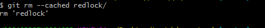

# **使用 Git Submodule 管理项目**

## **前言**

Pending

## ****使用场景****

基于公司的项目会越来越多，常常需要提取一个公共的类库提供给多个项目使用，但是这个library怎么和git在一起方便管理呢？

我们需要解决下面几个问题：

*   如何在git项目中导入library库?

      answer:git submodule add【library-url】，参考【****使用submodule】****。

 

*   library库在其他的项目中被修改了可以更新到远程的代码库中?

      answer:可以，需要在submodule目录更新提交，在业务架构中建议单人操作更新提交，实现读写剥离

*   其他项目如何获取到library库最新的提交?

      answer:【****使用submodule】****中有说明每个submodule中有独立的commit id，依赖commit id单独管理submodule目录，依据submodule目录中commit id是否与公共库的同步选择是否更新

 

*   如何在clone的时候能够自动导入library库?

      answer:参考【Clone Submodule】，此处建议方法二

解决以上问题，可以考虑使用git的 Submodule来解决。

## ****什么是Submodule?****

    git Submodule 是一个很好的多项目使用共同类库的工具，他允许类库项目做为repository,子项目做为一个单独的git项目存在父项目中，子项目可以有自己的独立的commit，push，pull。而父项目以Submodule的形式包含子项目，父项目可以指定子项目header，父项目中会的提交信息包含Submodule的信息，再clone父项目的时候可以把Submodule初始化。

## ****使用Submodule****

*   使用git命令直接添加Submodule：

git submodule add [<u>git@github.com:damonnie/redlock-php.git</u>](mailto:git@github.com:ronnylt/redlock-php.git) redlock（别名）

*   使用git status命令查看当前仓库状态：

     

可以看到多了两个需要提交的文件：.gitmodules和 redlock

*   .gitmodules 内容包含Submodule的主要信息，指定reposirory,指定路径:

    

*   要查看当前代码仓库所使用的子模块及其状态，除了看 .gitmodules 文件外，还可以执行 git submodule命令

     

*   新文件redlock保存子模块的信息，默认情况下子模块会将子项目放到一个与仓库同名的目录中，本例中是redlock。如果想放到其他地方，那么可以命令后添加一个不同的路径。此处，可以添加多个不同的子模块

     

这里需要说明的是，submodule目录只保护子项目的commit id，父项目的git并不会记录submodule的文件变动。另外，这两个文件都需要提交到父项目的git中

## ****修改Submodule(********业务仓库只读，公共仓库更新********)****

*   需要确认有对Submodule的commit权限：

         cd redlock 

*   修改其中的一个文件，git status查看变动：

         modified:   README.md

*   提交更改内容，并push远程

         git commit -m “test submodule”&& git push

*   此处redlock中已经变更为submodule最新的commit id.由原来的4066b307978ac81bf16e878aeb21210a5b794f06变更为717af34cae93e0d24dba04bbc166b8f1840f3893

     

## ****更新Submodule****

更新Submodule有两种方式:

*   在父项目的目录下直接运行

         git submodule foreach git pull

*   在Submodule的目录下面更新(推荐此操作)

         cd redlock && git checkout (所要同步的commit id所在分支) && git pull

        可以看到在Submodule的目录中,使用git和单独的一个项目是一样的,注意更新Submodule的时候如果有新的commit id产生，需要在父项目产生一个新的提交，git-Submodule文件中的 Submodule commit会变为最新的commit id。

## ****Clone Submodule****

clone Submodule有两种方式 一种是采用递归的方式clone整个项目，一种是clone父项目，再更新子项目

*   采用递归参数--recursive

         git clone git@github.com:DamonNie/git-Submodule.git --recursive

     

     这里一定要带上递归参数，否则init Submodule 的clone是不全的

*   第二种方法先clone父项目，再初始化Submodule

         git clone git@github.com:damonnie/git-Submodule.git && cd git-Submodule

*   初始化submodule:

         git submodule init

     

*   更新Submodule:

         git submodule update

     

    此处要注意:submodule文件都是init状态，如要获取最新，请切换要同步的commit id所在分支，并git pull操作

    

    

## ****删除Submodule****

git 并不支持直接删除Submodule需要手动删除对应的文件 

*   使用vim .git/config 可打开vim编辑,删除对应的内容
*   使用rm -rf .git/modules/redlock, 删除.git下的缓存模块，最后提交项目。
*   使用git rm --cached redlock将redlock从版本控制中删除（本地仍保留有），若不需要可不带 --cached进行完全删除

     

*   使用vim .gitmodules 可打开vim编辑,删除对应的内容
## ****遇见git submodule的坑****
*	切换分支的时候,终端突然出现这个问题 The following untracked working tree files would be overwritten by checkout。
     

字面意思上理解就是，有git工具没有跟踪到的文件切换后会被覆盖。通过资料查询解决方法
	
	**解决办法：删除这些文件，再切换到对的分支上再拉取代码**

  			git clean -d -fx ""

如若依然无法切换，删除git submodule对应控制的代码即可。

参考: <u>姜家志:</u>[<u>使用Git Submodule管理子模块</u>](https://segmentfault.com/a/1190000003076028)

<u>唐巧的博客:</u>[<u>Git submodule的坑</u>](https://blog.devtang.com/2013/05/08/git-submodule-issues/)
